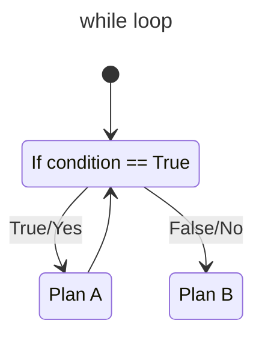
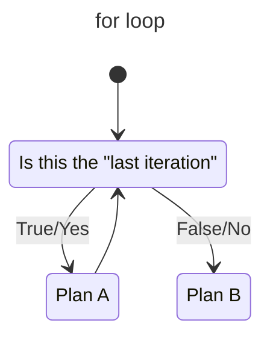

**Table of Contents**
- [Lecture 03: Python Crash Course (p3)](#lecture-03-python-crash-course-p3)
  - [Topics](#topics)
  - [Course materials](#course-materials)
- [Suggested reading](#suggested-reading)

# Lecture 03: Python Crash Course (p3)

## Topics
Here are the topics we are going to cover
* Recap of previous lecture
* `for` loops
* `functions` in Python
* Files and I/O
* Python libraries and how to use them
* Hands-on practices

## Course materials
* slides [[link](https://docs.google.com/presentation/d/12sswbD5br1wE6ZtqRJcNzuvQVTlDYIGl-pjnN3UXNc0/edit#slide=id.p)]
* `while` loop vs. `for` loop - instead of controling the loop via a "*conditio*n", we can control the loop via a precise "*counter*"

# Suggested reading
* [If available] Chapter 3 of **Python for Data Analysis: Data Wrangling with pandas, NumPy, and Jupyter** (3rd Edition by Wes McKinney)
  * Released August 2022
  * Publisher(s): O'Reilly Media, Inc.
  * ISBN: 9781098104030
* Online resources
  * `loops` in Python [[link](https://www.geeksforgeeks.org/loops-in-python/)]
  * `function` in Python [[link](https://www.w3schools.com/python/python_functions.asp)]
  * File operations in Python [[link](https://www.programiz.com/python-programming/file-operation)]
  * Common Python libraries [[link](https://learnpython.com/blog/python-libraries-for-beginners/)]
